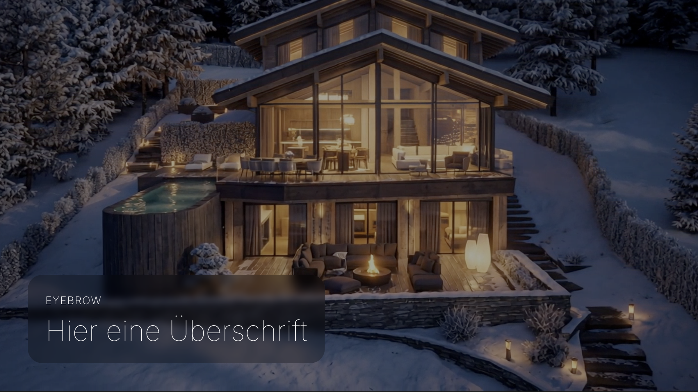

# UD Block: Hero Video

Ein Hero-Block mit Hintergrundvideo, Posterbild und Overlay-Text für den Einsatz im Header- oder Einstiegsbereich.

## Screenshots

### Editor

Screenshot des Blocks im Editor mit Medien-Auswahl, Textfeldern und Optionen.

### Frontend

Screenshot der fertigen Ausgabe im Frontend mit Video, Posterbild und Text-Overlay.

## Kontext

Der Block ist für den Einsatz im Block-Editor bzw. im FSE-Kontext gedacht und dient als visueller Einstieg einer Seite, Startseite oder eines Templates.

## Logik

Die Ausgabe erfolgt serverseitig über `render.php`.

Zentrale Logik:

- Videoquelle über `videoId` oder `videoUrl`
- Posterbild über `posterId` oder `posterUrl`
- Optionales Looping des Videos
- Steuerung, ob das Video auch mobil angezeigt wird
- Ausgabe von Eyebrow und Headline nur wenn befüllt
- Posterbild bleibt als visuelle Absicherung und Fallback erhalten

## Editor

Im Editor können folgende Inhalte bzw. Optionen gepflegt werden:

- Eyebrow
- Headline
- Video
- Posterbild
- Loop aktivieren
- Video auf mobilen Geräten anzeigen

Die Medien lassen sich sowohl über die Mediathek als auch über URL-Felder steuern.

## Frontend

Im Frontend wird ein Hero-Bereich mit Video, Posterbild, Overlay und Textbox ausgegeben.

Das Video wird ohne Controls ausgegeben und ist auf eine ruhige Hero-Darstellung ausgelegt.

## Hinweise

Der Block verwendet serverseitiges Rendering über `render_callback`.  
Zusätzliche Frontend-Logik ist aktuell nicht erforderlich.  
Die visuelle Ausgestaltung erfolgt primär über CSS.

## Autor

[ulrich.digital gmbh](https://ulrich.digital)

## Lizenz

GPL v2 or later
[https://www.gnu.org/licenses/gpl-2.0.html](https://www.gnu.org/licenses/gpl-2.0.html)