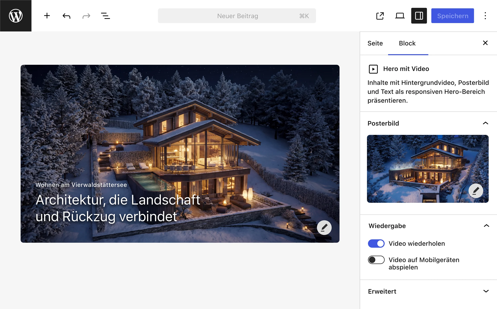

# UD Block: Hero mit Video

Ein individueller WordPress-Block für responsive Hero-Bereiche mit Hintergrundvideo, Posterbild und direkt editierbarem Text.

## Screenshots

### Editor

_Das Hintergrundvideo und die Texte werden direkt im Hero-Bereich bearbeitet. Das Posterbild und die Wiedergabeoptionen stehen im Inspector bereit._

## Einsatz

Der Block strukturiert den visuellen Einstieg einer Seite, Startseite oder eines Templates. Die Redaktion pflegt Video, Posterbild, Eyebrow, Überschrift und Wiedergabe direkt im WordPress-Editor.

## Funktionen

- Hintergrundvideo aus der WordPress-Mediathek
- Posterbild als Vorschaubild und mobile Alternative
- Direkt bearbeitbare Eyebrow und Überschrift
- Wiederholte Videowiedergabe als Option
- Steuerbare Videowiedergabe auf Mobilgeräten
- Responsive Ausgabe mit breiter und voller Ausrichtung
- Serverseitiges Rendering über `render.php`

## Bedienung im Editor

Das Hintergrundvideo wird über den Stift unten rechts im Hero-Bereich gewählt oder bearbeitet. Das Posterbild erscheint als Vorschau im Inspector und wird dort ebenfalls über einen Stift bearbeitet. Das einheitliche Symbol beschreibt jeweils die Aktion; seine Position macht das zugehörige Medium eindeutig.

Im Panel **Wiedergabe** stehen zwei Optionen zur Verfügung:

- **Video wiederholen**
- **Video auf Mobilgeräten abspielen**

Eyebrow und Überschrift lassen sich unmittelbar im Inhalt bearbeiten.

## Ausgabe im Frontend

Die Ausgabe erfolgt serverseitig. Das Video wird automatisch, stumm und inline wiedergegeben. Das Posterbild dient als Startbild und übernimmt auf Mobilgeräten die Darstellung, wenn die mobile Videowiedergabe deaktiviert ist. Die visuelle Ausgestaltung erfolgt über das Stylesheet des Blocks und kann im Theme weitergeführt werden.

## Autor

[ulrich.digital gmbh](https://ulrich.digital)

## Lizenz

GPL v2 or later

[https://www.gnu.org/licenses/gpl-2.0.html](https://www.gnu.org/licenses/gpl-2.0.html)
